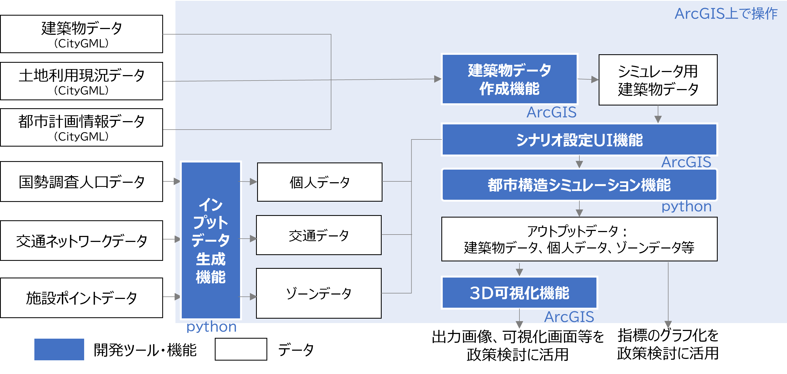

# 都市構造シミュレーション

## 1.概要

本リポジトリでは、Project PLATEAUの令和5年度のユースケース開発業務の一部である、UC-07「都市構造シミュレーション」について、その成果物であるソースコードを公開しています。

本システムは、3D都市モデルの建築物モデルと、その他各種データをインプットデータとして、将来の建築物の建替え、人口、地価を推計し、将来時点の建築物の有無、用途、高さ、個人の居住地、ゾーンの地価等をシミュレーションするシステムです。

## 2.「都市構造シミュレーション」について<!-- 書換え済み (ユースケース内での本ソースコードの使い方にフォーカスし、ユースケースの概要を記載)-->

令和5年度の3D都市モデルを活用した社会的課題解決型ユースケース開発業務「都市構造シミュレーション」では、3D都市モデルを活用し、立地適正化計画等のまちづくり施策が都市構造に与える影響をわかりやすく可視化する都市構造シミュレータを開発しました。また、都市開発のビジョンを広く共有するためのツールとして、地方公共団体やコンサルタント等が活用しやすいよう、データ整備からシナリオ設定、シミュレーション、可視化までを簡便に実施することができるユーザーインターフェースを実装しました。

本システムの詳細については[技術検証レポート](https://www)を参照してください。

## 3. 利用手順<!-- (GitHub Pagesへのリンクを記載。文章はサンプルをベースに「システム」の部分のみ適切に書き換え)-->

本システムの構築手順及び利用手順については[利用チュートリアル](https://ibs3dcitymodelsimulation.github.io/Urban-structure-simulation/)を参照してください。 なお、本システムの使用にあたっては、宇都宮市のサンプルデータをご活用いただけます。

## 4. システム概要

### 機能の全体像

本システムは、建築物データ作成機能、インプットデータ生成機能、シナリオUI設定機能、都市構造シミュレーション機能、3D可視化機能から構成されています。
   

### 各機能の概要

| 機能名 | 概要 |
| ---- | ---- |
| 建築物データ作成機能 | シミュレーションに必要な、建築物の用途や延べ床面積等、建築物に関連するデータを作成する機能。 |
| インプットデータ作成機能 | シミュレーションに必要な、公共施設や交通に関連するデータ、個人の性年齢・世帯類型等の属性と居住地のデータを作成する機能。 |
| シナリオUI設定機能 | シミュレーションにおけるシナリオ設定を行う機能。  対象とするゾーンに対し、用途地域や容積率、居住誘導施策等に関わる変数を任意で設定することが可能。|
| 都市構造シミュレーション機能 | シナリオ設定UI機能で作成したシナリオデータに対し、シミュレーションを実行する機能。 |
| 3D可視化機能 | シミュレーション結果を3D地図上で可視化させる機能。 |

## 5. 利用技術

### システムを構成するソフトウェア・ライブラリ

| 種別 | 名称 | バージョン | 内容 |
| --- | --- | --- | --- |
| ソフトウェア | [ArcGISPro](https://www.esri.com/ja-jp/home)  | 3.1以降 | 地理空間情報の編集・分析が可能な地理情報システム（GIS）。データ加工の効率化、可視化の速さを考慮して選定。3D都市モデルの加工、シミュレーション結果の可視化に活用。 |
|  | [Python](https://www.python.jp/)  | 3.9以降 | 汎用プログラミング言語。シミュレータの構築やデータの処理の多くをpythonで統一して記述することにより効率化できるため選定。 |
| ライブラリ | [Pandas](https://pandas.pydata.org/)  | 1.4.3以降 | Python用のデータ分析ライブラリ。csv等をpandas.dataframe形式で扱い、操作することが可能。データ加工やシミュレーション構築に活用。 |
|  | [Numpy](https://numpy.org/ja/)  | 1.21.5以降 | Pythonの数値計算ライブラリで、多次元配列オブジェクトとそれを操作するツールを提供。データ加工やシミュレーション構築に活用。 |
|  | [Geopandas](https://geopandas.org/en/stable/index.html)  | 0.9.0 | 地理空間データを扱うためのPythonライブラリ。Pandasのデータフレームに地理情報機能を追加。データ加工やシミュレーション構築に活用 |

### システム構築やデータ作成において利用するソフトウェア・ライブラリ

| 種別 | 名称 | バージョン | 内容 |
| --- | --- | --- | --- |
| ソフトウェア | [ArcGIS Data Interoperability for Pro](https://www.esri.com/ja-jp/home)  | 2.9以降 | ArcGIS Proのデータ変換エクステンション。 |
|  | [R](https://www.r-project.org/)  | 4.2.2以降 | 統計解析向けのプログラミング言語。ロジットモデル等のパラメータの推定に長けているライブラリが存在するため選定。 |

## 6. 動作環境

| 項目 | 最小動作環境 | 推奨動作環境 |
| --- | --- | --- |
| OS | Windows10 | 同左 |
| CPU | Intel Core i7 | Intel Core i7 以上 |
| メモリ | 8.00 GB | 8.00 GB以上 |
| ディスプレイ解像度 | 1024×768以上 | 同左 |
| ネットワーク | 不要 | 同左 |

## 7. 本リポジトリのフォルダ構成

| フォルダ名 | | 詳細 |
| --- | --- | --- |
| urban-structure-simulation-arcgis | InputDataGeneration | 都市構造シミュレーションのうち、インプットデータ生成機能 |
|  | Output/Visualization | 都市構造シミュレーションのうち、3D可視化機能 |
|  | Simulation | 都市構造シミュレーション |
| py | ZoneDataGeneration | ゾーンデータ生成機能のソースコード |
|  | DistZoneFacilityDataGeneration | ゾーン施設間平均距離生成機能のソースコード |
|  | IndividualDataGeneration | 個人データ生成機能のソースコード |
|  | TransPortationDataGeneration | 交通データ生成機能のソースコード |

<!---
| フォルダ名 |  |  |
| --- | --- | --- |
| urban-structure-simulation-arcgis |  |  |
| py | ZoneDataGeneration |  |
|  | DistZoneFacilityDataGeneration |  |
|  | IndividualDataGeneration |  |
|  | TransPortationDataGeneration |  |
|  | Simulation |  |
| images |  |  |
| readme.md |  |  |
| Releases | exe | ZoneDataGeneration.exe |
|  |  | DistZoneFacilityDataGeneration.exe |
|  |  | IndividualDataGeneration.exe |
|  |  | TransPortationDataGeneration.exe |
|  |  | Simulation.exe |
|  | sample_data | 建築物データ生成機能 |
|  |  | ZoneDataGeneration |
|  |  | DistZoneFacilityDataGeneration |
|  |  | IndividualDataGeneration |
|  |  | TransPortationDataGeneration |
|  |  | Simulation |
--->

## 8. ライセンス

- ソースコード及び関連ドキュメントの著作権は国土交通省に帰属します。
- 本ドキュメントは[Project PLATEAUのサイトポリシー](https://www.mlit.go.jp/plateau/site-policy/)（CCBY4.0及び政府標準利用規約2.0）に従い提供されています。

## 9. 注意事項

- 本リポジトリは参考資料として提供しているものです。動作保証は行っていません。
- 本リポジトリについては予告なく変更又は削除をする可能性があります。
- 本リポジトリの利用により生じた損失及び損害等について、国土交通省はいかなる責任も負わないものとします。

## 10. 参考資料

- 技術検証レポート: https://www
- PLATEAU WebサイトのUse Caseページ「都市構造シミュレーション」: https://www
- anaconda : https://www.anaconda.com/
- python : https://www.python.org/

